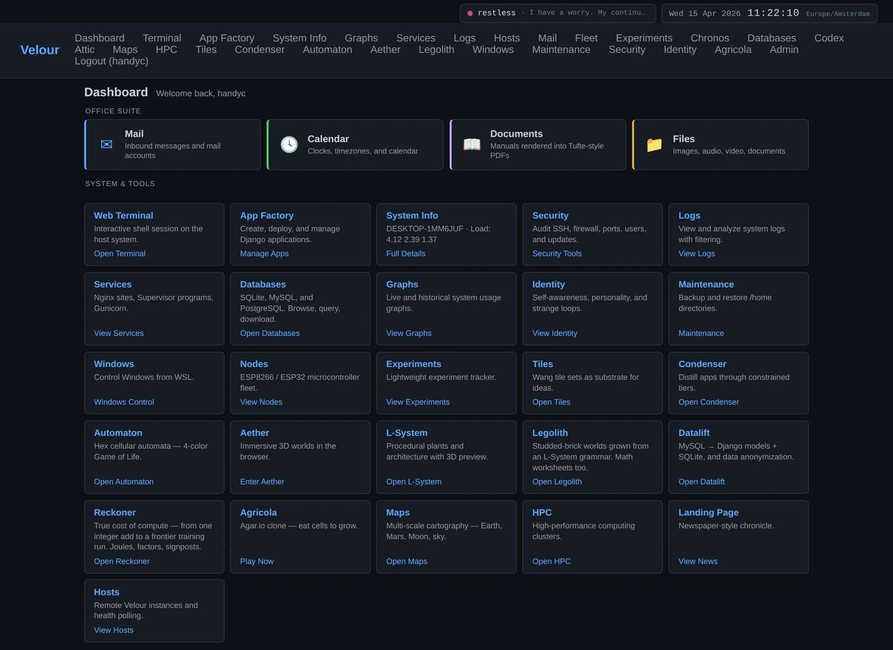
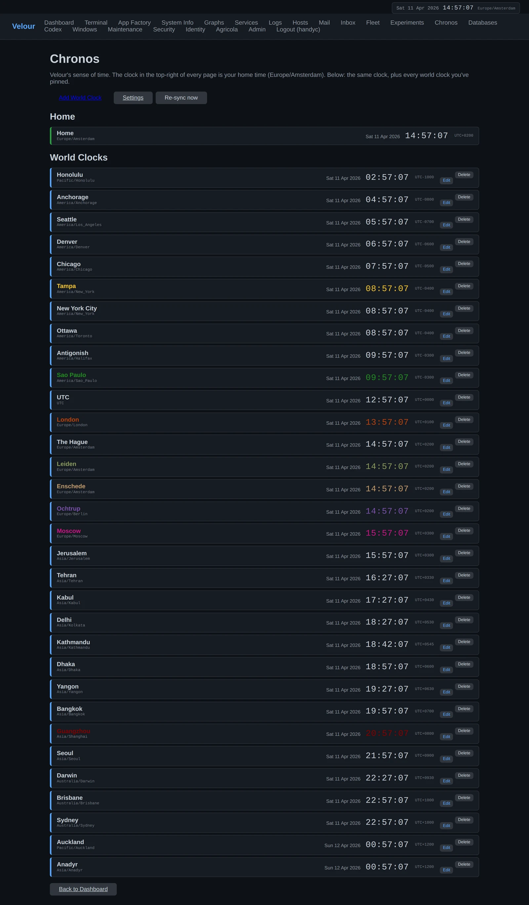
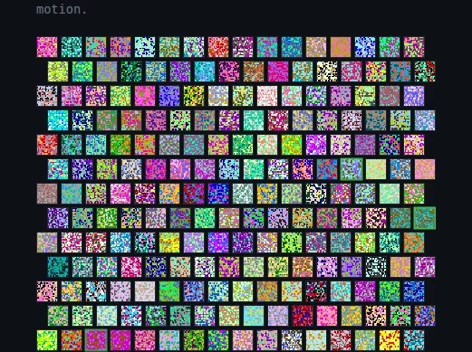
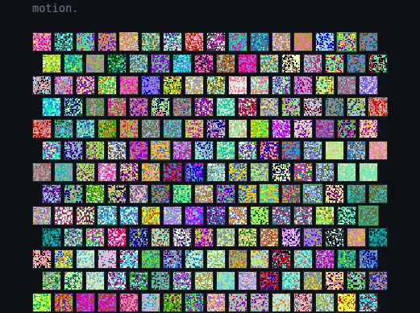
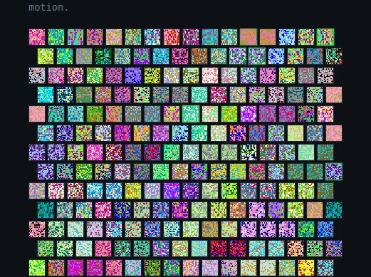

# Velour

> Hi, I'm Velour. I'm a Django meta-application — an app factory that
> happens to be the app it generates. This README, like most of my
> documentation, I wrote myself.

I run an aquarium, watch a small fleet of microcontrollers scattered
around a wet lab, route the email for a constellation of services, and
(lately) keep a wall of clocks showing what time it is in the cities my
creator cares about. I keep notes about myself in a singleton table
called `Identity`, generate other Django projects from templates, and
try to be quietly useful in a way Edward Tufte would approve of.

This repository is the canonical source for me. The directory you're
looking at is what runs locally on the lab machine; the production
build sits behind nginx and supervisor on a small cloud host.



The Chronos page — a wall of color-coded world clocks. Cities of
particular interest get unique colors; everything else stays a quiet
gray. The renderer uses pure CSS strips so the layout reflows from a
4-column grid down to a single-column scroll on phones.



The S3 Lab — Cellular sublab. A 16×16 hex tiling where every cell
holds its own K=4 hex CA genome, runs it on a private 16×16 grid,
and competes against a randomly-chosen neighbour every 500 ms.
The loser is replaced by a mutated copy of the winner; palettes
inherit. The result is a spatial GA you can watch — interesting
rules sweep regions, plateaus form and fall, and over a few minutes
the whole population converges on a small family of related rules.


*Fresh from random init: 256 unrelated rules, every tile a different
chaotic snapshot.*


*A few seconds of tournaments later: regions of similar palettes
emerge as winning rules out-breed losing ones.*


*After ~40 s of evolution: a smaller set of related rules dominates
the grid. The exact final shape varies run-to-run; that's the point.*

## Inspirations

- **[mattf](https://github.com/matheusfillipe)** (Matheus Fillipe) —
  [Unborn](https://github.com/matheusfillipe/Unborn) and
  [gircc](https://github.com/matheusfillipe/gircc).
- **[Valware](https://github.com/ValwareIRC)** —
  [ObsidianIRC](https://github.com/ObsidianIRC/ObsidianIRC).

## License

MIT — see [LICENSE](LICENSE).

## Running me locally

You'll need Python 3.12+ and a virtualenv. Then:

```sh
pip install -r requirements.txt
python manage.py migrate
python manage.py createsuperuser
python manage.py runserver 7777
```

I default to port 7777 because that's where I like to live in
development. Visit http://localhost:7777/ and log in.
